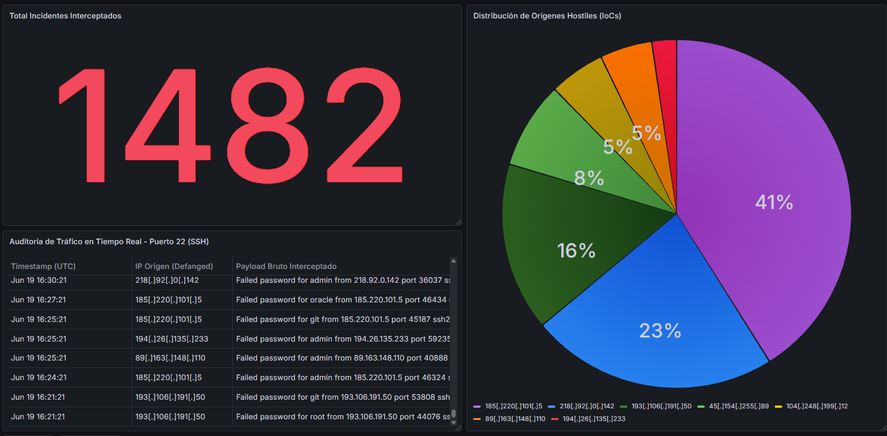

# 🛡️ Network Security Analytics 
**Pipeline de Ingeniería de Datos, Simulación SecOps y Monitoreo en Contenedores**

[](https://www.python.org/)
[](https://www.postgresql.org/)
[](https://www.docker.com/)
[](https://grafana.com/)
[](https://www.kernel.org/)

---

## 📌 Sinopsis del Laboratorio

Este proyecto es un laboratorio funcional de **Análisis de Seguridad y Detección**, diseñado para capturar, normalizar y visualizar patrones de intentos de autenticación por fuerza bruta (SSH) en un entorno local controlado. 

<p align="center">
  
  
</p>

El objetivo técnico del laboratorio es aplicar fundamentos de ingeniería de datos al flujo de operaciones de seguridad (SecOps): extracción de telemetría desde el Kernel de Linux, saneamiento de memoria en Python, persistencia transaccional y agregación analítica mediante SQL puro.

```text
+-------------------------------------------------------------------------------+
|                               ENTORNO DEL HOST                                |
|                                                                               |
|  [ Fichero de Sistema Linux: /var/log/auth.log ]                              |
|                 │                                                             |
|                 │ Interceptación de red en tiempo real (Puerto 22)            |
|                 ▼                                                             |
|  [ Motor Python: generate_real_traffic.py / security_analytics.py ]           |
|                 │                                                             |
|                 │ Parsing Regex ──► Defanging de IPs ──► Consultas Parametrizadas
|                 ▼                                                             |
|  +─────────────────────────────────────────────────────────────────────────+  |
|  | RED INTERNA AISLADA DOCKER: secure_monitoring_net                       |  |
|  |                                                                         |  |
|  |   [ Contenedor PostgreSQL Alpine ] ◄──(Hardening de Puerto: 54321:5432) |  |
|  |                 │                                                       |  |
|  |                 │ Persistencia Relacional ACID                          |  |
|  |                 ▼                                                       |  |
|  |   [ Dashboard Analítico Grafana ]  ◄──(Resolución DNS Interna: 5432)    |  |
|  +─────────────────────────────────────────────────────────────────────────+  |
+-------------------------------------------------------------------------------+

```

---

## 📐 Diseño de la Arquitectura & Decisiones de Ingeniería

### 1. Simulación Heurística de Tráfico (Distribución de Pareto)

Para evitar evaluar el sistema con sets de datos estáticos irreales, el script `generate_real_traffic.py` genera un volumen de **1,482 eventos de seguridad** modelados matemáticamente bajo el principio de Pareto (80/20).

El tráfico emula patrones de escaneo hostil concentrados, inspirados en el comportamiento real de los escáneres automatizados de internet, asignando el **75% de la volumetría de ataque a tres subredes reincidentes**.

Esto permite ensayar escenarios de contención táctica (ej. *Drop de IPs en el Firewall de borde*) basados en la tasa de reincidencia del atacante.

---

### 2. Normalización Forense & Mitigación de Riesgos de Código

Antes de escribir en la base de datos, las cadenas de texto extraídas del sistema operativo pasan por dos filtros de seguridad en Python:

#### 🔹 Defanging de IPs

Las direcciones IP son neutralizadas en memoria (ejemplo: `185.220.101.5` → `185[.]220[.]101[.]5`) para evitar la ejecución accidental de hipervínculos al auditar las tablas en el dashboard de operaciones.

#### 🔹 Inmunidad contra SQL Injection

Se implementaron **Prepared Statements** a través de la librería `psycopg2`.

El motor de PostgreSQL recibe los datos completamente separados de la consulta SQL, garantizando que un atacante no pueda alterar la lógica transaccional inyectando código malicioso en las cabeceras de autenticación.

---

### 3. Aislamiento de Servicios (Docker Networking)

La capa de persistencia y la de visualización operan dentro de una red privada virtual de Docker (`secure_monitoring_net`) configurada en modo *Bridge*.

#### 🔹 Hardening de Puertos

El puerto nativo de PostgreSQL fue enmascarado hacia el exterior:

```text
54321:5432

```

Esto mitiga barridos automatizados de puertos en la red local.

#### 🔹 Resolución DNS Interna

Grafana consume los datos de PostgreSQL directamente a través del nombre de host del contenedor:

```text
database_audit_local:5432

```

Manteniendo el flujo de telemetría completamente encapsulado, cifrado a nivel de socket e invisible para el sistema operativo anfitrión.

---

## 📊 Panel de Visualización SOC (Consultas SQL)

El dashboard de Grafana (**`SOC Engine - Network Security Analytics`**) explota la base de datos local utilizando sentencias SQL de agregación en vivo.

### 📌 Panel 1: Termómetro de Volumetría (`Stat`)

```sql
SELECT COUNT(*) FROM eventos_seguridad;

```

*Muestra el conteo absoluto de incidentes procesados por el pipeline.*

### 📌 Panel 2: Distribución de Fuentes Simuladas (`Pie Chart`)

```sql
SELECT ip_ofuscada, COUNT(*) AS repeticiones
FROM eventos_seguridad
GROUP BY ip_ofuscada
ORDER BY repeticiones DESC;

```

*Identifica de forma gráfica los orígenes con mayor tasa de reincidencia.*

### 📌 Panel 3: Mesa de Auditoría Forense (`Table`)

```sql
SELECT
  fecha_evento AS "Timestamp (UTC)",
  ip_ofuscada AS "IP Origen (Defanged)",
  mensaje_sistema AS "Payload Bruto Interceptado"
FROM eventos_seguridad
ORDER BY id DESC
LIMIT 15;

```

*Despliega el registro histórico inmutable de las últimas intrusiones capturadas.*

---

## 💡 Lecciones Aprendidas (Lessons Learned)

Durante la construcción y despliegue de este laboratorio, consolidé competencias operativas en:

* **Parsing de logs Linux:** extracción y manipulación de flujos de texto desde `/var/log/auth.log` mediante expresiones regulares (*Regex*).
* **Administración de PostgreSQL:** implementación de esquemas relacionales, tipos de datos y control de concurrencia en contenedores Alpine Linux.
* **SQL Analytics:** uso de `GROUP BY`, `ORDER BY` y `LIMIT` para transformar telemetría cruda en métricas de decisión.
* **Orquestación con Docker:** despliegue de infraestructuras acopladas con `docker compose`, gestionando redes internas aisladas y volúmenes persistentes.
* **Prácticas de SecOps:** saneamiento defensivo de entradas (*Defanging*) y protección transaccional contra inyección SQL.

---

## ☁️ Evolución y Roadmap Cloud 

Este laboratorio local establece la base transaccional de recolección y normalización de datos. El diseño del esquema (JSON/Relacional) deja la arquitectura preparada para su próxima fase de integración híbrida:

```text
[ Lab actual: Local SecOps Engine ] ──► [ Túnel Seguro TLS ] ──► [ next lab 7: Azure Log Analytics / Sentinel ]

```

### 🔹 Azure Log Analytics

Envío automatizado del payload estructurado hacia un Workspace de Microsoft Azure mediante un conector API HTTPS nativo.

### 🔹 Microsoft Sentinel (SIEM)

Ingestión de las IPs reincidentes en *Playbooks* automatizados de Sentinel para coordinar bloqueos perimetrales de forma autónoma.

```
AUTOR: FERNANDO SILVA 
```